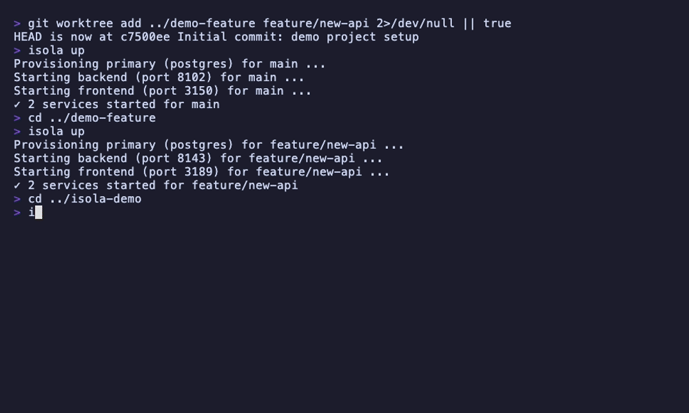

<!-- prettier-ignore -->
<p align="center">
  <picture>
    <source media="(prefers-color-scheme: dark)" srcset="assets/logo-dark.svg">
    
  </picture>
</p>

<h1 align="center">isola</h1>

**Run many isolated dev environments on one machine, one per git worktree.** Each worktree gets its own services, its own environment variables, and its own database cloned from a template. No Docker, no `/etc/hosts`, no port juggling, and it's built for the  parallel AI
coding agents.

## Why isola

Git [worktrees](https://git-scm.com/docs/git-worktree) let you check out several
branches at once. But the moment you *run* them, they collide.

Picture three things in flight: an AI agent refactoring on one branch, a spike on
another, a hotfix on `main`.

- They all try to bind `:3000` and `:5432`.
- They migrate and seed the **same** dev database, so one branch's schema change
breaks another, and a destructive test on one wipes data the others still need.
- You're juggling `.env` files, hunting down stray processes, and guessing which
server is which.
- Every fresh worktree starts empty: dependencies to install, migrations to run,
code to generate, all by hand before it will even start.

**isola gives each worktree its own running environment:** processes, ports,
`*.localhost` URLs, injected env vars, and its own database (cloned from a
template, dropped with the worktree). It runs each service's setup step first, so
a fresh worktree installs, migrates, and comes up on its own. So N branches, or N
agents, run fully isolated, side by side, and clean up after themselves.

## Features

- **Per-worktree isolation**: every worktree runs as its own environment, with its own processes, ports, URLs, environment variables, and database
- **Isolated databases**: every worktree gets its own database, created when it starts and removed when the worktree goes away
- **Automatic ports**: each service gets a stable port, with no clashes between worktrees
- **Subdomain proxy**: open each worktree in the browser at its own URL, over HTTP or HTTPS, with no hosts-file setup
- **Environment injection**: each service is handed the port and URLs it needs to reach the others, so nothing is hardcoded
- **Automatic setup**: each service can declare a setup step (install dependencies, run migrations, generate code) that isola runs before starting it, in the worktree's own environment, so a fresh worktree is ready with no manual prep. A top-level `setup` covers repo-root steps that belong to the whole worktree (a root install that wires up git hooks, generating a shared client), run once before any service
- **AI-agent friendly**: machine-readable output plus an installable [agent skill](#quick-start), so coding agents can drive it
- **TUI dashboard**: a terminal dashboard to start, stop, and monitor everything at once
- **Zero dependencies**: just one binary to install, no Docker
- **Per-worktree overrides**: change commands, ports, or environment per branch

## Demo


## Quick Start

### Set it up with your coding agent (recommended)

Run your agent in your project, paste this, and you're done:

```text
Set up isola for this project.

1. Add the isola skills: `npx skills add cyucelen/isola`.
2. Use the `isola-init` skill to do the setup. If it isn't available in this session, follow its guide: https://github.com/cyucelen/isola/blob/main/skills/isola-init/references/setup.md
```

> **Next project?**
> `/isola-init` in any new repo.

### Or set it up manually

#### 1. Install

```bash
# macOS (Homebrew)
brew install cyucelen/tap/isola

# Linux (.deb / .rpm are attached to each release):
#   https://github.com/cyucelen/isola/releases/latest
sudo dpkg -i isola_*_linux_amd64.deb   # Debian/Ubuntu
sudo rpm -i  isola_*_linux_amd64.rpm   # Fedora/RHEL

# Arch (AUR)
yay -S isola-bin

# Any platform with Go
go install github.com/cyucelen/isola@latest

# Or build from source
git clone https://github.com/cyucelen/isola.git
cd isola
make build
```

See the [install guide](skills/isola-init/references/install.md) for prerequisites and platform notes.

#### 2. Initialize

```bash
cd your-project
isola init
# Creates .isola.toml in the repo root
```

#### 3. Configure

Edit `.isola.toml` to match your project. Each service declares its own env;
values can reference isola-provided sources with `${...}`:

```toml
# Top-level, above any [section]: a repo-root step run once per worktree on up,
# before any service (e.g. a root install that also sets up git hooks).
setup = "pnpm install"

[services.web]
command = "pnpm run dev"
setup = "pnpm install"                     # runs before command on each up (deps, migrations)
dir = "web"
port_range = { min = 3100, max = 3199 }
proxy_port = 3000

# Injected into the process, and written to the service's env file:
[services.web.env]
API_URL = "${services.api.url}"

[services.api]
command = "go run ./cmd/server"
dir = "api"
port_range = { min = 8100, max = 8199 }
proxy_port = 8000

[services.api.env]
DATABASE_URL = "${accessories.database.url}"

# A background worker: no port_range/proxy_port, so no $PORT and no URL.
# isola still runs, manages, and injects env into it.
[services.worker]
command = "pnpm run worker"
dir = "api"

# A per-worktree database, cloned from a seeded template:
[accessories.database]
kind       = "postgres"
server_url = "postgres://postgres@localhost:5432/postgres"
clone_from = "myapp_dev"
name       = "myapp_${ISOLA_BRANCH_SLUG}"
```

Reference a sibling's URL or port, an accessory's connection string, or a
built-in with `${...}`, and isola resolves each to this worktree's real values.
Full walkthrough in the [isola-init setup guide](skills/isola-init/references/setup.md).

#### 4. Start services

```bash
isola up            # this worktree's services (also auto-starts the proxy)
isola up --all      # every worktree's services
```

Your services are now reachable at
`http://<branch-slug>.<project>.localhost:<proxy_port>` (e.g.
`http://main.myapp.localhost:3000`), where `<project>` is this repo's name
(default: its directory). One machine-wide proxy serves every project and runs
until `isola proxy stop`; HTTPS and opting out live under
[`[proxy]`](docs/configuration.md#proxy). Manage everything interactively with `isola dash`.

If you set up by hand, install the agent skill too so your agents can drive isola
day to day: `npx skills add cyucelen/isola`.

## Worktree setup automation

Each worktree's environment needs to be started (`isola up`) and, when the
worktree goes away, stopped. Do that by hand, or have isola do it automatically.

### Manual

Run `isola up` in the worktree to start it, `isola down` to stop it:

```bash
git worktree add ../my-feature -b my-feature
cd ../my-feature && isola up
```

### Automatic (git hook)

Install a `post-checkout` hook once and every new worktree comes up on its own:

```bash
isola hooks install            # just this clone
isola hooks install --shared   # share with your team
```

Anything that makes a worktree runs `git worktree add` underneath (your editor, a
parallel-agent tool like [Orca](https://onorca.dev) or [Herdr](https://herdr.dev),
or plain git), so this one hook covers them all. It runs `isola up` on new
worktrees only, and does nothing without a `.isola.toml`.

- **Skip once:** `ISOLA_NO_UP=1 git worktree add ...`
- **Using Orca?** `isola orca` wires it into `orca.yaml` instead, and the git hook stands down so nothing runs twice.
- **Check or remove:** `isola hooks status`, `isola hooks uninstall`.

### When a worktree is removed

Git has no worktree-removal hook, so isola reconciles: a removed worktree is torn
down automatically, its services stopped and the per-worktree databases it
provisioned dropped, on the next `isola up` and by the shared proxy in the
background. It only ever drops resources isola created. `isola down --prune` runs
the same teardown on demand, and `isola destroy` tears down the current worktree.

## Environment Variables

Each service declares its own `env`. Use `${...}` references and isola fills in
**this worktree's** real values, so nothing is hardcoded per branch. On a branch
`feat-login`:

```toml
[services.web.env]
API_URL      = "${services.api.url}"     # http://feat-login.myapp.localhost:8000
DATABASE_URL = "${accessories.database.url}"   # postgres://.../myapp_feat-login
```

Reference other services, accessories, and built-ins; isola injects the values
into the process. It also writes them into the service's `.env` file, updating an
existing file rather than creating one, so tools that read `.env` directly get the same isolated values. Full
list in the [Configuration Reference](docs/configuration.md).

## Accessories

An **accessory** is an isolated stateful dependency isola creates per worktree,
brought up on `isola up` and dropped on `isola down --prune`. isola connects to
your existing server (it never manages the server itself) and exposes a
connection string that a service references explicitly. Two kinds ship today:


| Kind       | Each worktree gets                                                                     |
| ---------- | -------------------------------------------------------------------------------------- |
| `postgres` | Its own database, physically cloned from a seeded template (via pgx, no `psql` needed) |
| `redis`    | Its own numbered logical DB, allocated collision-free and flushed on reset/drop        |


```toml
[accessories.database]
kind       = "postgres"
server_url = "postgres://postgres@localhost:5432/postgres"
clone_from = "myapp_dev"                    # seeded template, cloned per worktree
name       = "myapp_${ISOLA_BRANCH_SLUG}"

[accessories.cache]
kind       = "redis"
server_url = "redis://localhost:6379"
```

A service opts into an accessory by referencing its URL under whatever env key it
wants; the same value goes to the process env and the service's env file:

```toml
[services.api.env]
DATABASE_URL = "${accessories.database.url}"
REDIS_URL    = "${accessories.cache.url}"
```

Manage them out of band with `isola accessory ls|up|reset|drop [name]`. See the
[Configuration Reference](docs/configuration.md#accessoriesname) for every field
of each kind, and [Writing a new accessory](docs/writing-an-accessory.md) to add
your own.

## Configuration

Everything lives in a single `.isola.toml` at the root of your repository:
services (with their env), per-worktree accessories, the reverse proxy, and file
handling. The [**Configuration Reference**](docs/configuration.md) documents
every block and field; the [Quick Start](#quick-start) above covers the common
case.

## Commands


| Command                 | Description                                                                                  |
| ----------------------- | -------------------------------------------------------------------------------------------- |
| `isola init`            | Create a `.isola.toml` configuration file                                                    |
| `isola up`              | Start services for the current worktree                                                      |
| `isola up --all`        | Start services for all worktrees                                                             |
| `isola up --service`    | Start a specific service only                                                                |
| `isola down`            | Stop services for the current worktree                                                       |
| `isola down --all`      | Stop services for all worktrees                                                              |
| `isola down --prune`    | Stop services, then drop deleted worktrees' state and databases                              |
| `isola destroy`         | Stop the current worktree's services and drop its database (opposite of `up`)                |
| `isola ls`              | List all worktrees, services, ports, status, and URLs                                        |
| `isola logs [worktree]` | Tail a worktree's service logs                                                               |
| `isola accessory`       | Manage per-worktree databases: `ls`, `up`, `reset`, `drop`                                   |
| `isola dash`            | Open the interactive TUI dashboard                                                           |
| `isola proxy start`     | Start the machine-wide reverse proxy (auto-started by `up`)                                  |
| `isola proxy stop`      | Stop the reverse proxy                                                                       |
| `isola trust`           | Install the CA certificate into the system trust store                                       |
| `isola hooks install`   | Install a git hook that runs `isola up` when a worktree is created (`--shared` to commit it) |
| `isola orca`            | Add `isola up` to Orca's `orca.yaml` worktree setup hook                                     |
| `isola doctor`          | Run diagnostic checks on config and ports                                                    |
| `isola version`         | Print version information                                                                    |


HTTPS is enabled per project with `[proxy] https = true` in `.isola.toml` (not a flag).

## How It Works

```
  project "myapp"                    project "api"
  ┌───────────────────────┐          ┌───────────────────────┐
  │ main   frontend :3100 │          │ main   web      :3140 │
  │ feat   frontend :3117 │          │ dev    web      :3151 │
  └───────────┬───────────┘          └───────────┬───────────┘
              │      (each project registers in ~/.isola/registry)
              └──────────────┬───────────────────┘
              ┌──────────────▼──────────────┐
              │  isola proxy (machine-wide) │
              │  binds :3000, :8000, ...    │
              │  routes by <branch>.<proj>  │
              └──────────────┬──────────────┘
                             ▼
  main.myapp.localhost:3000     main.api.localhost:3000
  feat.myapp.localhost:3000     dev.api.localhost:3000
```

1. **Port allocation**: each service gets a backend port via `FNV32(branch:service) % range`, skipping ports already in use so projects never share one. Stable across restarts.
2. **Process management**: services run as child processes with process groups. Logs go to `.isola/logs/`.
3. **Shared proxy**: one machine-wide daemon reads `~/.isola/registry`, binds the union of every project's `proxy_port`s, and routes each request by its `<branch>.<project>.localhost` host to that project's backend (resolved live from the project's own state).
4. `**.localhost**`: per [RFC 6761](https://tools.ietf.org/html/rfc6761), modern browsers resolve `*.localhost` (including `<branch>.<project>.localhost`) to `127.0.0.1` automatically.

## TUI Dashboard

Launch it with `isola dash`:



## Shell Completion

isola supports shell completion for bash, zsh, fish, and PowerShell.

**bash:**

```bash
source <(isola completion bash)
# Or for persistent use:
isola completion bash > /etc/bash_completion.d/isola
```

**zsh:**

```bash
isola completion zsh > "${fpath[1]}/_isola"
# You may need to start a new shell for this to take effect.
```

**fish:**

```bash
isola completion fish | source
# Or for persistent use:
isola completion fish > ~/.config/fish/completions/isola.fish
```

**PowerShell:**

```powershell
isola completion powershell | Out-String | Invoke-Expression
# Or for persistent use:
isola completion powershell > isola.ps1
# and add ". isola.ps1" to your PowerShell profile.
```

## Troubleshooting

Start with `isola doctor`, which checks your config and ports. The
[Troubleshooting guide](docs/troubleshooting.md) covers the common failures and
their fixes: services that won't start, port conflicts, stale processes, proxy
routing, and HTTPS.

## Platform Support


| Platform    | Status          | Notes                                                                                          |
| ----------- | --------------- | ---------------------------------------------------------------------------------------------- |
| **macOS**   | Fully supported | Primary development platform                                                                   |
| **Linux**   | Fully supported | Tested on Ubuntu, Debian, Fedora                                                               |
| **Windows** | Experimental    | Basic functionality works; file locking uses alternative implementation. Please report issues. |


## FAQ

### Can I use isola without the proxy?

Yes. `isola up` starts your services on their allocated ports; reach them
directly at `localhost:<port>`. The proxy (and its `*.localhost` routing) is
optional; disable auto-start with `[proxy] enabled = false`.

### Where does isola keep its files?

Two places. **Per repository**, in `.isola/` at the main worktree root: runtime
state (service PIDs, port assignments, accessory handles) in `.isola/state.json`
(file-locked for concurrent access), and service logs at
`.isola/logs/<branch-slug>.<service>.log`.

**Machine-wide**, in `~/.isola/`: the shared proxy's registry (`registry.json`)
and daemon state (`proxy.json`), the proxy log (`logs/proxy.log`), and the
auto-generated HTTPS CA and certificates (`certs/`), so one proxy and one trusted
CA cover every project.

## Contributing

1. Fork the repository
2. Create your feature branch (`git checkout -b feature/amazing`)
3. Commit your changes (`git commit -m 'feat: add amazing feature'`)
4. Push to the branch (`git push origin feature/amazing`)
5. Open a Pull Request

```bash
# Development
make build      # Build binary
make test       # Run tests with race detector
make lint       # Run golangci-lint
make all        # fmt + vet + lint + test + build
```

## Credits &amp; prior art

isola is a fork of [**portree**](https://github.com/fairy-pitta/portree) by [fairy-pitta](https://github.com/fairy-pitta), and builds directly on its worktree-aware process management, hash-based port allocation, and `*.localhost` reverse proxy. Huge thanks to the portree authors for that foundation.

**If you just need per-worktree dev servers** (port allocation and subdomain routing, without databases or other stateful isolation), [portree](https://github.com/fairy-pitta/portree) is the simpler, focused tool. isola extends that model toward **full per-worktree environment isolation**: databases and other stateful accessories, cloned from a template and torn down together with the worktree.

## License

MIT License. See [LICENSE](./LICENSE) for details.